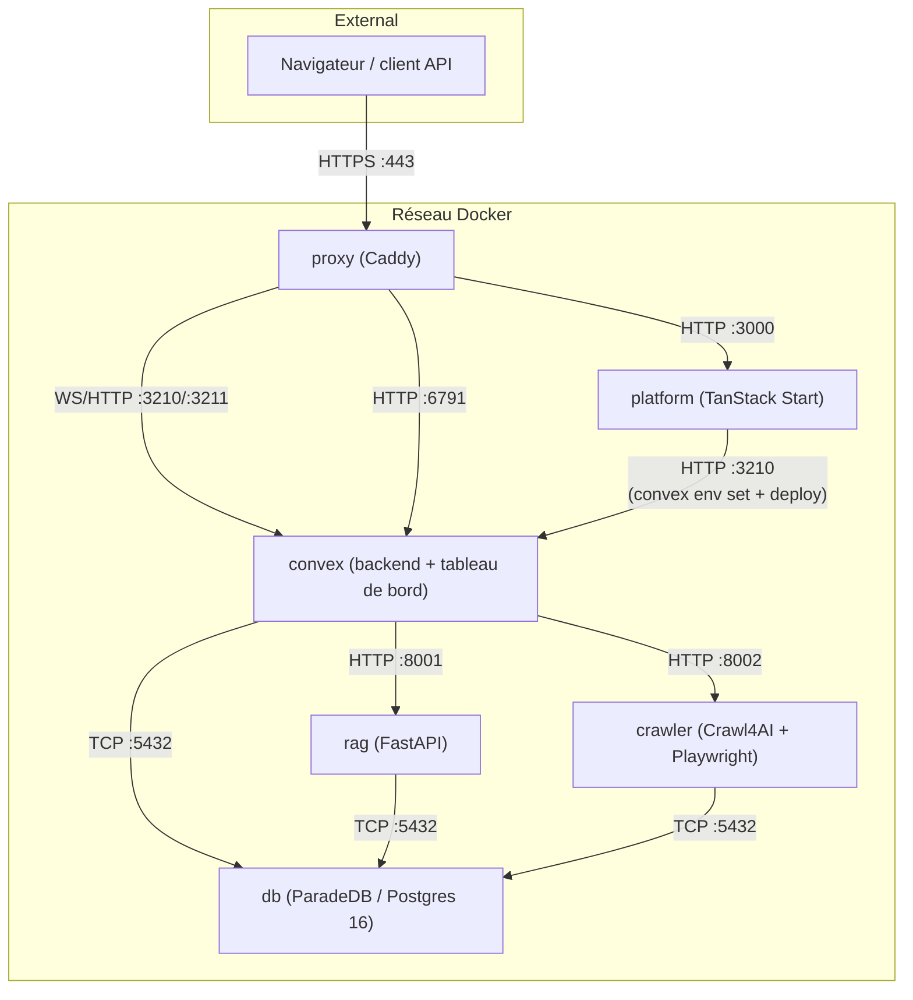

Tale tourne en six conteneurs Docker pilotés par Docker Compose, chacun avec une responsabilité unique et un port unique sur le réseau bridge interne. Cette page est le modèle mental de l'opérateur sur ce qui tourne, où, et comment les services se parlent : quels volumes sont partagés, quels ports sont exposés, où la topologie blue-green se replie sur elle-même pendant un déploiement. Ouvre-la quand quelque chose n'atterrit pas là où tu l'attends — un endpoint de métriques injoignable, un port exposé par erreur, une bascule blue-green qui n'a pas drainé proprement.

Les six conteneurs sont stables sur chaque chemin d'installation. Démarrage rapide, déploiement en production et CI montent tous le même ensemble ; seuls les mappages de ports, le mode TLS et les bindings d'hôte diffèrent.

## Comment les services se parlent

Le proxy est le seul conteneur qui écoute sur un port public. Tout le reste reste sur le bridge Docker interne ; la plateforme ne touche jamais Postgres directement parce que Convex possède chaque lecture et écriture qui atterrit dans la base. RAG et le crawler parlent à la base pour leurs propres tables par service (schémas `tale_knowledge`) mais ne lisent ni n'écrivent jamais les tables Convex.

## Détails d'image

| Service  | Image de base                                                              | Taille compressée | Stratégie de build                                                         |
| -------- | -------------------------------------------------------------------------- | ----------------- | -------------------------------------------------------------------------- |
| Platform | `ghcr.io/get-convex/convex-backend` (pour le binaire glibc `generate_key`) | ~320 Mo           | 5 étapes : deps → builder → pruner → runner → squash                       |
| Convex   | `ghcr.io/get-convex/convex-backend`                                        | ~485 Mo           | 2 étapes : dashboard → runner (tableau de bord COPY depuis l'image amont)  |
| Crawler  | `python:3.11-slim`                                                         | ~650 Mo           | 3 étapes : builder → runtime → squash. Chromium headless_shell uniquement. |
| RAG      | `python:3.11-slim`                                                         | ~515 Mo           | 3 étapes : builder → runtime → squash. libpq5 uniquement.                  |
| DB       | `paradedb/paradedb:0.22.5-pg16`                                            | ~1,06 Go          | 3 étapes : cleanup → runtime → squash.                                     |
| Proxy    | `caddy:2.11-alpine`                                                        | ~88 Mo            | Une seule étape.                                                           |

Sortir Convex de l'image plateforme a fait passer la couche plateforme d'environ 2,58 Go compressés à environ 320 Mo ; le nouveau service convex pèse environ 485 Mo. Le disque image net est similaire, mais la couche plateforme se reconstruit beaucoup plus vite pour les changements purement applicatifs — la plupart des pull requests ne touchent que la SPA ou le serveur Bun, et l'image plateforme est celle que la CI reconstruit à chaque merge.

## Mappage de ports

### Ports de développement (`compose.yml`)

| Service  | Port hôte | Port conteneur   | Protocole           |
| -------- | --------- | ---------------- | ------------------- |
| DB       | 5432      | 5432             | TCP (PostgreSQL)    |
| Crawler  | 8002      | 8002             | HTTP                |
| RAG      | 8001      | 8001             | HTTP                |
| Convex   | —         | 3210, 3211, 6791 | WS/HTTP (via proxy) |
| Platform | —         | 3000             | HTTP (via proxy)    |
| Proxy    | 80, 443   | 80, 443          | HTTP/HTTPS          |

### Ports de test (`compose.test.yml`)

| Service  | Port hôte           | Port conteneur   |
| -------- | ------------------- | ---------------- |
| DB       | 15432               | 5432             |
| Crawler  | 18002               | 8002             |
| RAG      | 18001               | 8001             |
| Convex   | 13210, 13211, 16791 | 3210, 3211, 6791 |
| Platform | 13000               | 3000             |
| Proxy    | 10080, 10443        | 80, 443          |

Le fichier compose de développement expose les quatre ports backend sur l'hôte (5432, 8001, 8002) pour un accès direct depuis le portable du développeur ; le compose de production généré par `tale deploy` ne le fait pas — chaque port backend reste sur le bridge interne.

## Mappage de volumes

| Volume          | Monté dans                | Chemin                                   | Rôle                                                                                                                                                    |
| --------------- | ------------------------- | ---------------------------------------- | ------------------------------------------------------------------------------------------------------------------------------------------------------- |
| `db-data`       | DB                        | `/var/lib/postgresql/data`               | Répertoire de données PostgreSQL.                                                                                                                       |
| `db-backup`     | DB                        | `/var/lib/postgresql/backup`             | Sauvegardes de base de données.                                                                                                                         |
| `rag-data`      | RAG                       | `/app/data`                              | Fichiers temporaires, traitement des documents.                                                                                                         |
| `crawler-data`  | Crawler                   | `/app/data`                              | Registre de sites web, bases d'URL.                                                                                                                     |
| `convex-data`   | Convex                    | `/app/data`                              | Base Convex (SQLite/pg-local), index de recherche, fichiers, agents/workflows/intégrations/fournisseurs JSON semés.                                     |
| `convex-data`   | Platform                  | `/app/data` _(lecture seule)_            | Veille SSE de configuration et service d'images de marque.                                                                                              |
| `convex-data`   | Crawler, RAG              | `/app/platform-config` _(lecture seule)_ | Config de fournisseur partagée.                                                                                                                         |
| `caddy-data`    | Proxy, Convex             | `/data`, `/caddy-data`                   | Certificats TLS.                                                                                                                                        |
| `caddy-config`  | Proxy                     | `/config`                                | Configuration Caddy.                                                                                                                                    |
| `platform-data` | — _(historique, démonté)_ | —                                        | Préservé après la mise à niveau de séparation Convex pour la sûreté du rollback. À retirer manuellement après vérification avec `docker volume rm ...`. |

Ne fais jamais tourner `docker compose down -v`. Le drapeau `-v` supprime chaque volume nommé, c'est-à-dire la base, chaque fichier téléversé, l'état du crawler et les certificats TLS. Pas de récupération possible.

## Arguments de build

| Argument            | Défaut  | Utilisé par | Description                                                  |
| ------------------- | ------- | ----------- | ------------------------------------------------------------ |
| `VERSION`           | `dev`   | Tous        | Tag de version de l'image, posé par la CI depuis le tag git. |
| `INSTALL_CJK_FONTS` | `false` | Crawler     | Installe le support des polices CJK (~100 Mo).               |

## Stratégie de build multi-étapes

Chaque service se termine par une étape `FROM scratch` de squash. Cette étape finale aplatit les couches Docker pour que les suppressions de fichiers dans les étapes de nettoyage précédentes récupèrent de l'espace disque au lieu d'ajouter des couches de masquage ; sans le squash, un `rm -rf` à l'étape quatre coûterait encore les octets supprimés dans l'image finale.

### Platform (5 étapes, après scission)

1. `bun-bin` — extrait le binaire Bun.
2. `workspace-deps` — installe chaque dépendance npm, devDependencies incluses.
3. `builder` — fait tourner `vite build` pour produire le bundle SPA.
4. `pruner` — réinstalle les deps de production uniquement, retire les paquets de test et de développement.
5. `runner` — runtime final sur l'image de base `convex-backend` (gardée pour le binaire glibc `generate_key` qui sert à signer les jetons admin Convex). SPA Vite et serveur Bun uniquement — pas de processus backend Convex.

Une étape `squash` sur `FROM scratch` puis `COPY --from=runner` produit l'image livrée. Le conteneur tourne brièvement en root, descend à l'utilisateur `app` via `gosu` dans l'entrypoint.

### Convex (2 étapes, nouveau en Phase 2)

1. `convex-dashboard` — `FROM ghcr.io/get-convex/convex-dashboard` pour copier le build standalone Next.js.
2. `runner` — `FROM ghcr.io/get-convex/convex-backend`. Contient le démon local-backend, le tableau de bord, les assets de seed intégrés (agents, workflows, intégrations, fournisseurs, image de marque) et l'entrypoint. Retire LLVM et Clang pour environ 155 Mo d'économies.

### Crawler (3 étapes)

1. `builder` — installe les dépendances Python via `uv`, télécharge Chromium `headless_shell`, fait tourner un nettoyage profond (retire le binaire Chrome complet, FFmpeg, pip, `__pycache__`, les symboles de debug `.so`, les répertoires de test).
2. `runtime` — `python:3.11-slim` propre avec uniquement les bibliothèques système runtime (deps Chromium, tini, curl). Retire LLVM et le jeu d'icônes Adwaita.
3. `squash` — `FROM scratch` plus `COPY --from=runtime`. Préalloue les points de montage de volumes pour `/app/data` et `/app/platform-config`.

### RAG (3 étapes)

1. `builder` — installe les deps Python avec `build-essential` et `libpq-dev` pour compiler les paquets natifs, puis retire pip et setuptools.
2. `runtime` — `python:3.11-slim` propre avec uniquement `libpq5` et curl. Préalloue les points de montage de volumes.
3. `squash` — `FROM scratch` plus `COPY --from=runtime`.

### DB (3 étapes)

1. `cleanup` — retire les symboles de debug (environ 888 Mo), les bibliothèques partagées LLVM (environ 127 Mo), les fichiers de l'extension PostGIS, les locales et les docs depuis l'image de base ParadeDB.
2. `runtime` — `FROM scratch` plus `COPY --from=cleanup`. Couche fraîche avec uniquement les fichiers nettoyés.
3. `squash` — redéclare `PGDATA`, `PATH` et les autres variables ENV perdues pendant `FROM scratch`.

## Health checks

| Service  | Endpoint                                              | Protocole      | Période de démarrage |
| -------- | ----------------------------------------------------- | -------------- | -------------------- |
| DB       | `pg_isready -U tale -d tale`                          | CLI            | 60s                  |
| Crawler  | `GET /health` sur :8002                               | HTTP           | 40s                  |
| RAG      | `GET /health` sur :8001                               | HTTP           | 40s                  |
| Convex   | `GET :3210/version` + `[ -f /tmp/convex-ready ]`      | HTTP + fichier | 60s                  |
| Platform | `GET :3000/api/health` + `[ -f /tmp/platform-ready ]` | HTTP + fichier | 180s                 |
| Proxy    | `GET /health` sur :2020 (interne)                     | HTTP           | 10s                  |

Les marqueurs `/tmp/<service>-ready` sont touchés par l'entrypoint de chaque service après que son travail d'initialisation en une passe se termine — Convex après que le backend est en marche et que le seed intégré atterrit ; la plateforme après que la synchronisation d'environnement et `convex deploy` réussissent. Le fichier marqueur est ce qui empêche le proxy de router le trafic vers un conteneur qui accepte les connexions mais n'est pas encore prêt à servir.

## Test des conteneurs

Tale inclut trois scripts de test de conteneurs qui tournent en CI à chaque pull request et que tu peux faire tourner sur un hôte de développement avant de pousser :

| Script                                  | Commande                            | Ce qu'il teste                                                                                |
| --------------------------------------- | ----------------------------------- | --------------------------------------------------------------------------------------------- |
| `tests/container-smoke-test.sh`         | `bun run docker:test`               | Builds, démarrages, health checks, endpoints HTTP, connectivité entre services.               |
| `tests/container-image-test.sh`         | `bun run docker:test:image`         | Labels OCI, utilisateur non-root, pas de secrets, instruction HEALTHCHECK, budgets de taille. |
| `tests/container-vulnerability-scan.sh` | `bun run docker:test:vulnerability` | Analyse de vulnérabilités Trivy (HIGH + CRITICAL).                                            |

Le [guide Contributing Docker](/fr/develop/contributing-docker) couvre chaque script en détail.

## Où cela s'insère

L'architecture des conteneurs est le modèle mental de ce qui tourne, où et comment les services se parlent. Ouvre-la quand quelque chose n'atterrit pas là où tu l'attends — un endpoint de métriques injoignable, un port exposé par erreur, une bascule blue-green qui n'a pas drainé proprement. Pour les surfaces d'observabilité par service, [Exploitation](/fr/self-hosted/operate/observability/operations) est la page suivante ; pour les boutons en variable d'environnement, [Référence d'environnement](/fr/self-hosted/configuration/environment-reference) est exhaustive.
