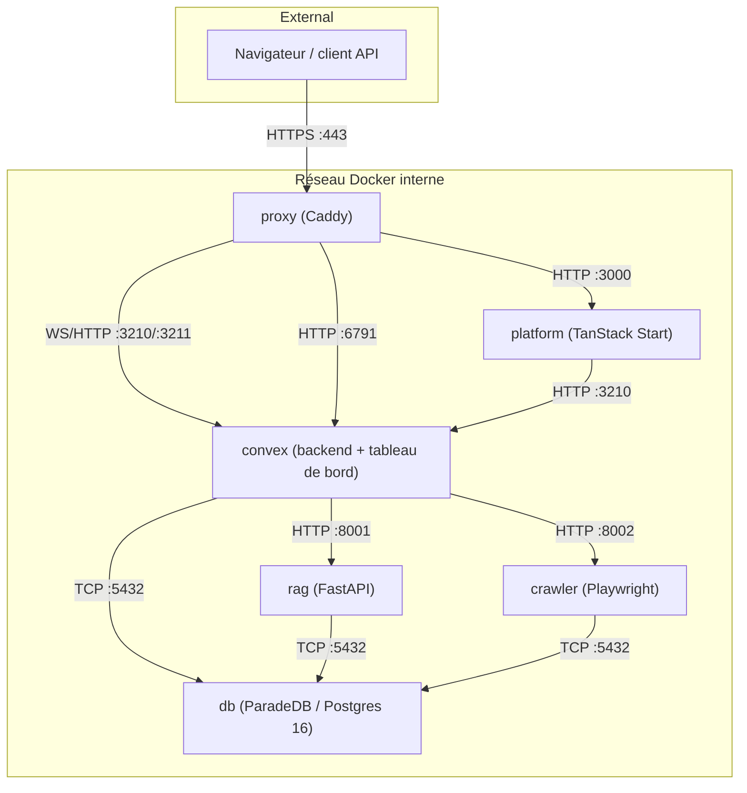

Tale auto-hébergé tourne comme une stack Docker Compose de six conteneurs sur une infrastructure que tu contrôles. Pas de frais par siège, pas de restriction de modèle au-delà de ce que ta clé API autorise, et aucune donnée ne quitte jamais ton réseau, sauf si tu pointes un fournisseur vers un endpoint externe. Cette page est l'instantané qu'un opérateur lit avant l'installation : quels sont les conteneurs, où atterrissent les ports, combien la stack coûte en RAM et en disque.

Si tu viens ici pour installer, le [Démarrage rapide](/fr/self-hosted/install/quickstart) et le [Déploiement en production](/fr/self-hosted/install/linux-server) sont la prochaine étape. L'aperçu ci-dessous s'adresse au lecteur qui décide encore si Tale auto-hébergé colle à son environnement.

## Six conteneurs, un réseau

Tale tourne comme six conteneurs Docker derrière un seul proxy Caddy. Le proxy est le seul service qui écoute sur un port public ; chaque autre service parle à ses pairs sur un réseau Docker en bridge interne. Le bundle reste identique que tu fasses tourner sur un laptop de développeur ou sur un serveur de production — seuls le mode TLS et le nom d'hôte changent.

| Conteneur  | Image de base                        | Rôle                                                                                 | Port interne     |
| ---------- | ------------------------------------ | ------------------------------------------------------------------------------------ | ---------------- |
| `proxy`    | Caddy                                | Terminaison TLS, routage, ACME pour Let's Encrypt                                    | 80, 443          |
| `platform` | Convex Backend (pour `generate_key`) | App TanStack Start, SPA Vite, serveur Bun                                            | 3000             |
| `convex`   | Convex Backend                       | Backend local Convex, tableau de bord Convex, seed intégré                           | 3210, 3211, 6791 |
| `rag`      | `python:3.11-slim`                   | Service FastAPI pour le chunking de documents, embeddings, recherche sémantique      | 8001             |
| `crawler`  | `python:3.11-slim`                   | Crawl4AI + Playwright pour le crawling de sites et la conversion fichier → texte     | 8002             |
| `db`       | `paradedb/paradedb:0.22.5-pg16`      | PostgreSQL 16 avec pgvector + pg_search pour la recherche vectorielle et plein texte | 5432             |

Le conteneur `platform` est un runtime léger — la SPA plus le serveur Bun qui la fronte. Convex vit dans son propre conteneur parce qu'il possède le backend temps réel, l'ensemble des fonctions et le tableau de bord local ; l'éclatement a fait passer l'image platform d'environ 2,58 Go compressé à environ 320 Mo et a rendu les rebuilds purement applicatifs bien plus rapides. Le tableau complet des tailles d'image et des builds multi-étapes vit sur [Architecture des conteneurs](/fr/self-hosted/operate/container-architecture).

## Comment les services se parlent

Le proxy ventile le trafic entrant entre la SPA platform et les endpoints WebSocket de Convex. Convex est la source de vérité pour l'état applicatif — il pousse mutations, lectures et résultats de fonctions vers la platform par WebSocket — et il parle directement à la base de données et aux deux services Python. La platform ne touche jamais Postgres ; tout passe par Convex.

## Ce qu'il faut pour la faire tourner

Pour une installation laptop, le seul prérequis est Docker Desktop 24 ou plus récent. Pour un serveur de production, la page [Déploiement en production](/fr/self-hosted/install/linux-server) couvre la liste complète des prérequis ; les chiffres-clés sont :

- **RAM** — 8 Go pour tourner, 12 Go pour supporter un déploiement blue-green. Le blue-green fait tourner la nouvelle couleur à côté de l'ancienne jusqu'à ce que les health-checks passent, donc deux exemplaires de chaque service sans état existent brièvement.
- **Disque** — environ 4,4 Go compressé pour le premier pull d'image, plus ce que ta base de connaissances et ton historique de chat font grossir.
- **Réseau** — ports 80 et 443 publics, chaque autre port reste sur le bridge Docker. Le HTTPS sortant vers les fournisseurs IA (ou vers ton backend d'inférence interne) est le seul trafic externe.

La base de données bundled suffit à la plupart des installations. Si tu veux un Postgres managé ou que tu as besoin de résidence des données dans un cluster spécifique, l'architecture supporte de pointer chaque service vers une instance Postgres externe — les étapes vivent sur la page [Déploiement en production](/fr/self-hosted/install/linux-server#using-an-external-database).

## Ce que le produit couvre

Tale livre chaque fonctionnalité documentée sous [Platform](/fr/platform) — chat avec conversations multi-tours et pièces jointes, agents personnalisés avec leurs propres instructions et outils, workflows d'automatisation avec étapes LLM et conditions, base de connaissances sémantique pour documents et sites, boîte de réception pour conversations clients, contrôle d'accès basé sur les rôles à travers six rôles, et SSO Microsoft Entra. Les pages indexées par rôle sous [Platform](/fr/platform) s'appliquent à l'identique en Cloud et auto-hébergé ; les seules différences vivent dans cette section — installation, fichiers de configuration, architecture des conteneurs, observabilité, le chemin d'authentification par en-tête HTTP de confiance.

L'accessibilité fait partie du même bundle. Tale vise [WCAG 2.1 niveau AA](https://www.w3.org/TR/WCAG21/) — navigation clavier, landmarks pour lecteurs d'écran, indicateurs de focus visibles, contraste 4,5:1 sur le texte courant, support des mouvements réduits, et une cible tactile minimale de 24 × 24. Le pipeline CI le fait respecter via les règles jsx-a11y de oxlint, les assertions vitest-axe sur les composants rendus, et l'addon a11y de Storybook.

## Où ça s'inscrit

L'aperçu est l'image architecturale qu'un opérateur lit une fois. À partir d'ici, [Démarrage rapide](/fr/self-hosted/install/quickstart) et [Déploiement en production](/fr/self-hosted/install/linux-server) amènent une box fraîche jusqu'à une instance qui tourne ; [Architecture des conteneurs](/fr/self-hosted/operate/container-architecture) est la référence plus profonde pour les ports, volumes et la forme des health-checks esquissés ci-dessus ; et [Exploitation](/fr/self-hosted/operate/observability/operations) catalogue ce qu'il faut scraper, logguer et alerter une fois que le trafic commence à couler. Le produit lui-même — chat, agents, automatisations, connaissances — vit une seule fois sous [Platform](/fr/platform) et se lit à l'identique en Cloud.
