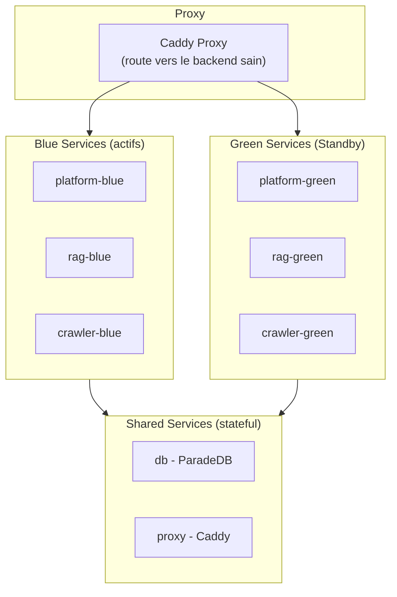

Tale est une plateforme IA open source, auto-hébergée, pour les équipes qui veulent une application IA complète qu’elles possèdent, contrôlent et étendent. Elle inclut un assistant de chat intelligent, une base de connaissances sémantique, la gestion des conversations clients, des workflows d’automatisation visuels et une couche API structurée.

Contrairement aux produits IA cloud-only, Tale tourne entièrement sur ton infrastructure. Tes données restent sur tes serveurs. Pas de frais par siège, pas de verrouillage fournisseur, aucune restriction de modèle au-delà de ce que supporte ta clé API.

## L’architecture en un clin d’œil

Tale tourne comme cinq services Docker qui communiquent sur un réseau interne :

| Service  | Techno                                       | Rôle                                                              | Port local       |
| -------- | -------------------------------------------- | ----------------------------------------------------------------- | ---------------- |
| Platform | Bun + TanStack + Convex                      | UI web, backend temps réel, auth, data, workflows                 | 3000 (via proxy) |
| RAG      | Python + FastAPI                             | indexation, recherche vectorielle, génération de réponse          | 8001             |
| Crawler  | Python + Playwright + Crawl4AI               | crawling de sites, découverte d’URLs, conversion fichier → texte  | 8002             |
| Database | ParadeDB (PostgreSQL + pg_search + pgvector) | stockage persistant, recherche plein texte, recherche vectorielle | 5432             |
| Proxy    | Caddy                                        | terminaison TLS et routage                                        | 80 / 443         |

> **Note :** Toutes les communications entre services restent sur le réseau Docker interne. Seuls les ports 80 et 443 sont exposés publiquement via le proxy Caddy. La base (5432) et les services API (8001, 8002) ne sont exposés sur l’hôte que pour le dev local.

## Capacités principales

- Chat IA avec conversations multi-tours, pièces jointes, sélection d’agent, [Mode Arène](/fr/platform/chat/arena-mode) pour comparer des modèles, [canevas](/fr/platform/workspace/canvas) pour éditer du contenu et outils intégrés.
- [Bibliothèque de prompts](/fr/platform/workspace/prompt-library) pour enregistrer et partager des modèles de prompt.
- Base de connaissances sémantique pour documents, sites, Produits, Clients, Fournisseurs avec [comparaison de documents](/fr/platform/workspace/document-comparison).
- Boîte de réception pour conversations clients avec réponses assistées par IA et actions en masse.
- Constructeur d’automatisation visuel avec étapes LLM, conditions, boucles et plannings.
- Agents IA sur mesure avec instructions, connaissances et outils dédiés.
- Contrôle d’accès par rôle, du Membre en lecture seule à l’Admin complet.
- SSO et intégrations dont Microsoft Entra ID, REST API, synchro OneDrive et connecteurs SQL.
- Opérations de production avec déploiements zero-downtime, métriques Prometheus et tracking d’erreurs Sentry.
- Accessibilité WCAG 2.1 AA sur toutes les pages et composants.

## Accessibilité

Tale est conçu pour se conformer à [WCAG 2.1 Level AA](https://www.w3.org/TR/WCAG21/). Chaque page et composant est dessiné et testé selon ces standards pour que la plateforme soit utilisable par tous, y compris les personnes utilisant des technologies d’assistance.

Principales fonctionnalités d’accessibilité :

- **Navigation clavier** — tous les éléments interactifs sont accessibles et opérables au clavier avec focus visibles.
- **Support des lecteurs d’écran** — landmarks HTML sémantiques (`<main>`, `<nav>`, `<header>`), hiérarchie de titres correcte, labels ARIA et régions live pour le contenu dynamique.
- **Skip navigation** — lien "aller au contenu principal" pour permettre aux utilisateurs clavier de sauter la navigation répétée.
- **Couleur et contraste** — tous les textes respectent un ratio 4.5:1 pour le texte normal et 3:1 pour le texte large. L’information n’est jamais véhiculée par la seule couleur.
- **Mouvement réduit** — toutes les animations et transitions respectent la préférence `prefers-reduced-motion`.
- **Accessibilité des formulaires** — labels associés aux inputs, messages d’erreur identifiant le champ et le correctif, états de validation communiqués via ARIA.
- **Dialogues et overlays** — focus piégé dans les dialogues ouverts et rendu au déclencheur à la fermeture.
- **Cibles tactiles** — taille minimale de 24 × 24 pixels CSS pour les éléments interactifs.

### Tests automatisés

La conformité accessibilité est imposée à plusieurs niveaux :

| Niveau              | Outil                                   | Ce qui est vérifié                                         |
| ------------------- | --------------------------------------- | ---------------------------------------------------------- |
| Linting             | oxlint avec plugin jsx-a11y (27 règles) | validité ARIA, HTML sémantique, handlers clavier, alt text |
| Tests de composants | vitest-axe (`checkAccessibility`)       | audit axe-core WCAG 2.1 AA sur composants rendus           |
| Storybook           | @storybook/addon-a11y                   | panneau a11y visuel avec règles WCAG 2.1 AA                |

Les standards de code dans `AGENTS.md` exigent pour chaque nouveau composant UI un bloc de test a11y utilisant `checkAccessibility()` depuis les utilitaires de test partagés.

## Où ça s'inscrit

La vue d'ensemble auto-hébergée est l'instantané architectural pour l'exploitant qui jauge la plateforme. À partir d'ici, les pages d'installation amènent une machine fraîche du zéro à une instance Tale qui tourne ; les pages de configuration cataloguent chaque bouton qui existe ; les pages d'exploitation couvrent à quoi ressemble la forme de long terme de Tale en production. Le produit lui-même — chat, agents, automatisations — est le même que sur le Cloud et est documenté sous [Platform](/fr/platform).
