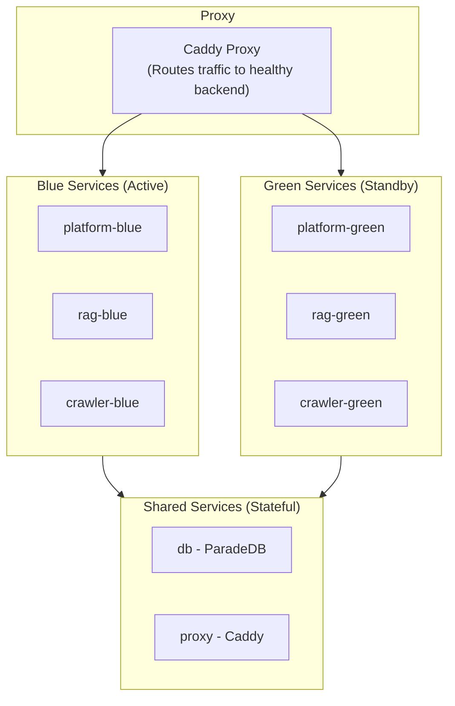

Tale is an open-source, self-hosted AI platform for teams that want a full-stack AI application they can own, control, and extend. It includes an intelligent chat assistant, a semantic knowledge base, customer conversation management, visual automation workflows, and a structured API layer.

Unlike cloud-only AI products, Tale runs entirely on your own infrastructure. Your data stays on your servers. There are no per-seat fees, no vendor lock-in, and no model restrictions beyond what your API key supports.

## Architecture at a glance

Tale runs as five Docker services that communicate over an internal network:

| Service | Technology | Role | Local port |
| --- | --- | --- | --- |
| Platform | Bun + TanStack + Convex | Web UI, real-time backend, auth, data, workflows | 3000 (via proxy) |
| RAG | Python + FastAPI | Document indexing, vector search, answer generation | 8001 |
| Crawler | Python + Playwright + Crawl4AI | Website crawling, URL discovery, file-to-text conversion | 8002 |
| Database | ParadeDB (PostgreSQL + pg_search + pgvector) | Persistent storage, full-text search, vector search | 5432 |
| Proxy | Caddy | TLS termination and routing | 80 / 443 |

> **Note:** All communication between services stays on the internal Docker network. Only ports 80 and 443 are exposed publicly through the Caddy proxy. The database (5432) and API services (8001, 8002) are exposed on the host for local development only.

## Key capabilities

- AI chat assistant with multi-turn conversations, file attachments, agent selection, and built-in tools
- Semantic knowledge base for documents, websites, products, customers, and vendors
- Customer conversations inbox with AI-assisted replies and bulk actions
- Visual automation builder with LLM steps, conditionals, loops, and scheduling
- Custom AI agents with tailored instructions, knowledge, and tools
- Role-based access control from read-only Member to full Admin
- SSO and integrations including Microsoft Entra ID, REST APIs, OneDrive sync, and SQL connectors
- Production operations with zero-downtime deployments, Prometheus metrics, and Sentry error tracking
