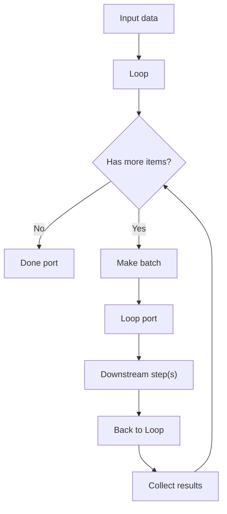

## Workflow Module — Developer Guide

This document describes the workflow system implementation, including the data model, public APIs, step/node execution, the adapter to the component engine, scheduling, logging, and example client usage.

### Highlights

- **Templates**: manage workflows via `wfDefinitions` and `wfStepDefs`
- **Execution**: track `wfExecutions`, approvals in `approvals`
- **Node types**: `trigger`, `llm`, `condition`, `approval`, `action`, `loop`
- **Adapter**: delegates execution to `@convex-dev/workflow` components with journaling
- **Scheduler**: scans active scheduled workflows every 5 minutes
- **🆕 Inline Execution**: execute workflows with manually passed configurations (bypasses database)
- **🆕 Unified Architecture**: single execution engine for both database and inline workflows

---

## Architecture

```
convex/workflow/
├── api/                  # Public Convex functions (management, execution, scheduler)
├── adapter/              # Bridge to component engine (start/driver/completion)
├── core/                 # Step executor entrypoint (internal)
├── database/             # Internal CRUD for definitions, steps, executions
├── manager.ts            # WorkflowManager (dynamic workflow definition)
├── nodes/                # Node executors (trigger, llm, condition, approval, action, loop)
├── types/                # Type defs and validators
├── utils/                # Helpers (variables, conditions, helpers)
```

Key flows:

- Client → `api/management` to manage templates and steps
- Client → `api/execution` to start/trigger, monitor, cancel/resume, read logs/stats
- `api/execution.startWorkflow` → `adapter/component.startWithComponent`
- Component engine journals steps → `adapter/component.componentDriver` → `runComponentDriver`
- Completion is mirrored back to `wfExecutions` via `onWorkflowComplete`

---

## Data model (schema)

Tables and notable indexes from `convex/schema.ts`:

- `wfDefinitions`

  - Fields: `organizationId`, `name`, `description?`, `version`, `status`, `triggers`, `config?`, `metadata?`
  - Indexes: `by_org`, `by_org_status`

- `wfStepDefs`

  - Fields: `organizationId`, `wfDefinitionId`, `stepSlug`, `name`, `description?`, `stepType`, `order`, `nextSteps`, `config`, `inputMapping?`, `outputMapping?`, `metadata?`
  - Indexes: `by_definition`, `by_definition_order`, `by_step_id`

- `wfExecutions`

  - Fields: `organizationId`, `wfDefinitionId`, `status`, `currentStepId`, `waitingFor?`, `startedAt`, `updatedAt`, `completedAt?`, `componentWorkflowId?`, `variables?`, `input?`, `output?`, `triggeredBy?`, `triggerData?`, `metadata?`
  - Indexes: `by_org`, `by_definition`, `by_status`, `by_org_status`, `by_component_workflow`

- `approvals`
  - Fields: `organizationId`, `wfExecutionId?`, `stepSlug?`, `approverMemberId?`, `status`, `submittedData`, `decision?`, `comments?`, `reviewedAt?`, `decidedAt?`, `assignedAt?`, `resourceType`, `resourceId`, `routeHint?`, `deeplink?`, `priority`, `dueDate?`, `metadata?`
  - Indexes: `by_organization`, `by_approver_status`, `by_execution`, `by_org_status`, `by_resource`

---

## Public API

All public functions live under `api.workflow.api.*`.

### Management (`api/management.ts`)

- `createWorkflow` (mutation) → returns `Id<'wfDefinitions'>`
- `updateWorkflow` (mutation)
- `deleteWorkflow` (mutation)
- `listWorkflows` (query)
- `getWorkflow` (query)
- `activateWorkflow` (mutation)
- `deactivateWorkflow` (mutation)
- `duplicateWorkflow` (mutation)

Step wrappers:

- `createStep` (mutation) → returns `Id<'wfStepDefs'>`
- `updateStep` (mutation)
- `deleteStep` (mutation)
- `listWorkflowSteps` (query)
- `getOrderedSteps` (query)
- `reorderSteps` (mutation)

### Execution (`api/execution.ts`)

- Start: `startWorkflow` (mutation) → returns `Id<'wfExecutions'>`
- Manual trigger: `triggerWorkflow` (mutation; requires `triggers.manual`)
- Status: `getExecutionStatus` (action) by execution handle
- Cancel: `cancelExecution` (action) → marks as failed with `error='cancelled'`
- Read: `getExecution` (query), `listExecutions` (query)
- Stats: `getExecutionStats` (query) → totals, success rate, avg duration, last execution

### Approvals (`nodes/approval/api.ts`)

- `createApprovalTask` (mutation)
- `getApprovalTask` (query)
- `listPendingApprovals` (query)
- `updateApprovalStatus` (mutation)
- `approveWorkflowStep` (mutation)
- `rejectWorkflowStep` (mutation)
- `getApprovalHistory` (query)

---

## Execution engines

### Adapter to component engine (`adapter/component.ts`)

- `startWithComponent` creates a `wfExecutions` row, then starts a component workflow via `workflowManager.start` using `dynamicWorkflow`, storing the returned `componentWorkflowId` on the execution. Also logs `component_workflow_created`.
- `componentDriver` is invoked by the component pool; it calls `runComponentDriver`, which:
  - Loads the component journal
  - Determines last completed step result
  - Merges returned `variables` into `wfExecutions.variables`, keeping `organizationId`
  - Routes using ports: `nextStepId = nextSteps[port]` (no stepType-specific branching, no default fallback)
  - Marks execution as waiting (`waitingFor='approval'`) while keeping `status='running'` when approval steps are waiting for a decision
  - Completes or fails the execution when no next step or on error
  - Starts the next step by recording a journal entry that calls `internal.workflow.core.executor.executeStep`
- Completion hooks mirror the final component status to `wfExecutions`:
  - `onWorkflowComplete`

### Dynamic manager (`manager.ts`)

- Defines `dynamicWorkflow` with `WorkflowManager` to iterate ordered steps and call `internal.workflow.core.executor.executeStep`. Marks execution completed/failed via internal mutations.

---

## Node executors

- Trigger (`nodes/trigger/executor.ts`): supports `manual | schedule | webhook | event`. Merges `triggerData` and context into variables. Uses `replaceVariables` for templating.
- LLM (`nodes/llm/executor.ts`): executor present; configure via `LLMNodeConfig` types.
- Condition (`nodes/condition/executor.ts`): evaluates expressions using JEXL (JavaScript Expression Language) for safe, powerful condition evaluation.
- Approval (`nodes/approval/executor.ts`): creates an approval task and returns `{ approvalTaskId }`.
- Action (`nodes/action/executor.ts`): resolves action by type via registry (`nodes/action/actions/*`) and executes it; basic retry policy placeholders.

Step results follow `StepExecutionResult` and include `port`, `variables`, `output`, and may include `threadId`, `approvalTaskId`.

### Loop Node

The Loop node provides explicit, predictable iteration in workflows. Unlike implicit iteration styles (e.g., in some tools), Loop is an intentional step with clear routing and rich context. It supports single-item or batched processing and includes safety guards to prevent infinite loops.

- Ports: `loop` (continue processing) and `done` (no more items)
- Suited for: bulk operations, rate-limited APIs, chunked processing, controlled retries

#### Configuration

```typescript
interface LoopNodeConfig {
  batchSize: number; // Size of each batch; default 1
  maxIterations?: number; // Safety cap; default 1000
  itemVariable?: string; // Name for current item/batch; default 'item'
  indexVariable?: string; // Name for current index; default 'index'
  continueOnError?: boolean; // Continue when a downstream step fails; default false
  description?: string; // Optional description
}
```

#### Flow (high level)



#### Context and variables

During execution, Loop exposes template variables:

- `` – The current item (for batchSize=1) or current batch (an array when batchSize>1)
- `` – The zero-based index of the item/batch
- `{{loopContext.currentIndex}}` – Current item index
- `{{loopContext.batchIndex}}` – Current batch index
- `{{loopContext.totalItems}}` – Total number of items
- `{{loopContext.totalBatches}}` – Total number of batches
- `{{loopContext.processedCount}}` – Number of items processed so far
- `{{loopContext.remainingItems}}` – Number of items remaining
- `{{loopContext.isFirstBatch}}` – Whether this is the first batch
- `{{loopContext.isLastBatch}}` – Whether this is the last batch

#### Examples

Basic per-item iteration:

```json
{
  "stepSlug": "loop_customers",
  "stepType": "loop",
  "config": {
    "batchSize": 1,
    "itemVariable": "customer",
    "indexVariable": "customerIndex"
  },
  "nextSteps": {
    "loop": "send_email",
    "done": "finish"
  }
}
```

Batched iteration (useful for rate limiting):

```json
{
  "stepSlug": "loop_batches",
  "stepType": "loop",
  "config": {
    "batchSize": 5,
    "maxIterations": 100,
    "itemVariable": "batch",
    "continueOnError": false
  },
  "nextSteps": {
    "loop": "api_call",
    "done": "complete"
  }
}
```

### Condition Node Configuration

The condition node uses **JEXL (JavaScript Expression Language)** for safe, powerful expression evaluation.

#### JEXL Expressions (Recommended)

Use the `expression` property with a JEXL expression string:

```json
{
  "stepType": "condition",
  "config": {
    "expression": "steps.assess_churn.output.isChurned == true"
  }
}
```

**Benefits:**

- **Safe**: No arbitrary code execution, sandboxed expression evaluation
- **Powerful**: Supports complex logic, comparisons, math, array operations, and transforms
- **Readable**: Natural JavaScript-like syntax
- **Flexible**: Direct variable access or template syntax `{{...}}`

**Common JEXL Operations:**

```javascript
// Comparison operations
'value1 == value2'; // Equality
'score > 0.8'; // Greater than
'age >= 18 && verified == true'; // Logical AND

// Logical operations
'isChurned == true && score > 0.8';
"status == 'active' || status == 'trial'";
'!(disabled == true)';

// Array operations
"['active', 'pending', 'trial'].includes(status)";
'items.length > 0';
'items[0].price > 100';

// String operations
"name|upper == 'JOHN'"; // Transform to uppercase
'description|trim|length > 10'; // Chain transforms
"email.includes('@example.com')";

// Math operations
'price * quantity > 1000';
'(subtotal + tax) * 0.9';

// Ternary operator
"age >= 18 ? 'adult' : 'minor'";
```

#### Template Variable Syntax

You can use `{{...}}` template syntax for variable substitution:

```json
{
  "stepType": "condition",
  "config": {
    "expression": "{{steps.assess_churn.output.isChurned}} == true"
  }
}
```

**Note:** When using `{{...}}` template syntax, the expression inside is evaluated as JEXL. Use `==` for equality comparisons:

- ✅ Correct: `{{loop.item.status == "active"}}`
- ✅ Also correct: `loop.item.status == "active"` (without template syntax)
- ❌ Incorrect: `{{loop.item.status === "active"}}` (JEXL uses `==`, not `===`)

#### Variable Access

JEXL expressions can access any variable in the workflow context:

- `steps.stepSlug.output.field` - Output from previous steps
- `workflow.variables.field` - Workflow-level variables
- `workflow.metadata.field` - Workflow metadata
- `loop.item` - Current loop item (in loop contexts)
- `loop.index` - Current loop index (in loop contexts)

#### Real-World Examples

**Customer Churn Detection:**

```json
{
  "stepType": "condition",
  "config": {
    "expression": "steps.assess_churn.output.isChurned == true && steps.assess_churn.output.score > 0.85 && ['low_activity', 'payment_issues'].includes(steps.assess_churn.output.reason)"
  }
}
```

**Subscription Validation:**

```json
{
  "stepType": "condition",
  "config": {
    "expression": "steps.fetch_customer.output.customer.subscriptionCount == 0 || !steps.fetch_customer.output.customer.metadata.subscriptions"
  }
}
```

**Loop Item Filtering:**

```json
{
  "stepType": "condition",
  "config": {
    "expression": "loop.item.status == 'active' && loop.item.price > 100"
  }
}
```

**Complex Business Logic:**

```json
{
  "stepType": "condition",
  "config": {
    "expression": "(steps.check.output.status == 'active' && steps.check.output.verified == true) || steps.check.output.role == 'admin'"
  }
}
```

---

## Variables and flow

- Variables are initialized from `input` plus `organizationId`.
- After a successful step, returned `variables` are merged into `wfExecutions.variables`. The adapter also sets:
  - `lastOutput` to the last step's output
  - `steps[<currentStepId>].output` structured map
- Routing semantics (ports-based):
  - `trigger`: `success`
  - `action`/`llm`: `success` or `failure`
  - `condition`: `true` or `false`
  - `approval`: `approve` or `reject` (marks execution as waiting: `waitingFor='approval'`)
  - `loop`: `loop` or `done`
  - Fallback: `default`

### Secure Variables

The `set_variables` action supports a `secure` flag for handling encrypted credentials:

**Features:**

- Variables with `secure: true` are automatically decrypted using the workflow's encryption key
- Decrypted values are stored in the `secrets` namespace (`secrets[name]`)
- Accessible via `{{secrets.name}}` template syntax
- Provides better security isolation for sensitive data

**Example:**

```typescript
{
  stepSlug: 'set_credentials',
  stepType: 'action',
  config: {
    type: 'set_variables',
    parameters: {
      variables: [
        {
          name: 'username',
          value: '{{provider.username}}',
        },
        {
          name: 'password',
          value: '{{provider.passwordEncrypted}}',
          secure: true, // Automatically decrypt and store in secrets
        },
      ],
    },
  },
}
```

**Usage in subsequent steps:**

```typescript
{
  stepSlug: 'connect',
  stepType: 'action',
  config: {
    type: 'imap',
    parameters: {
      username: '{{username}}',
      password: '{{secrets.password}}', // Access from secrets namespace
    },
  },
}
```

**Security Benefits:**

- ✅ Encrypted values remain encrypted until needed
- ✅ Decryption happens automatically in secure context
- ✅ Secrets stored separately from regular variables
- ✅ Clear intent that data is sensitive
- ✅ Easier to audit secret usage

---

## Scheduler

- `convex/crons.ts` registers: every 5 minutes call `internal.workflow.api.scheduler.scanAndTrigger`
- `api/scheduler.ts`:
  - `scanAndTrigger` finds active workflows with `triggers.schedule` and starts them when due
  - Maintenance utilities: `cleanupOldExecutions`, `generateWeeklyReport`, `monthlyMaintenance`, `archiveUnusedWorkflows`

---

## Logs and stats

- `getExecutionStepJournal` reads rich step-by-step execution journals from the `@convex-dev/workflow` component
- `getExecutionStats` returns counts and average execution time for recent executions

---

## Client usage

Prerequisites:

```tsx
'use client';
import { useQuery, useMutation, useAction } from 'convex/react';
import { api } from '@/convex/_generated/api';
import { Id } from '@/convex/_generated/dataModel';
```

Template management example:

```tsx
const workflows = useQuery(api.workflow.api.management.listWorkflows, {
  organizationId,
});
const createWorkflow = useMutation(api.workflow.api.management.createWorkflow);
const activateWorkflow = useMutation(
  api.workflow.api.management.activateWorkflow,
);
const wfDefinitionId = await createWorkflow({
  organizationId,
  name: 'My Workflow',
  description: 'Example template',
  triggers: { manual: true },
});
await activateWorkflow({ wfDefinitionId });
```

Start workflow and poll status:

```tsx
const startWorkflow = useMutation(api.workflow.api.execution.startWorkflow);
const getExecutionStatus = useAction(
  api.workflow.api.execution.getExecutionStatus,
);
const handle = await startWorkflow({
  organizationId,
  wfDefinitionId,
  input: { any: 'data' },
  triggeredBy: 'manual',
  triggerData: {
    triggerType: 'manual',
    timestamp: Date.now(),
  },
});
const status = await getExecutionStatus({ handle });
```

Cancel:

```tsx
const cancelExecution = useAction(api.workflow.api.execution.cancelExecution);
await cancelExecution({ handle });
```

Read execution and stats:

```tsx
const execution = useQuery(api.workflow.api.execution.getExecution, {
  executionId,
});
const stats = useQuery(api.workflow.api.execution.getExecutionStats, {
  wfDefinitionId,
});
```

Step authoring (wrappers):

```tsx
const createStep = useMutation(api.workflow.api.management.createStep);
await createStep({
  organizationId,
  wfDefinitionId,
  stepSlug: 'my_step',
  name: 'My Step',
  stepType: 'action',
  order: 1,
  config: { type: 'log', parameters: { message: 'Hello' } },
  nextSteps: { success: 'next_step_id' },
});
```

## 🆕 Inline Workflow Execution

Execute workflows with manually passed configurations, bypassing database storage:

```tsx
const executeWorkflowWithConfig = useMutation(
  api.workflow.api.execution.executeWorkflowWithConfig,
);

const executionId = await executeWorkflowWithConfig({
  organizationId,
  workflowConfig: {
    name: 'Dynamic Workflow',
    description: 'Generated at runtime',
    version: '1.0.0',
  },
  stepsConfig: [
    {
      stepSlug: 'trigger_start',
      name: 'Start',
      stepType: 'trigger',
      order: 1,
      config: { type: 'manual' },
      nextSteps: { default: 'llm_step' },
    },
    {
      stepSlug: 'llm_step',
      name: 'Process with LLM',
      stepType: 'llm',
      order: 2,
      config: {
        name: 'Processor',
        model: 'gpt-4o-mini',
        systemPrompt: 'You are a helpful assistant.',
        userPrompt: 'Process: {{input}}',
      },
      nextSteps: {},
    },
  ],
  input: { data: 'Hello world' },
  triggeredBy: 'api_call',
});
```

**Key Benefits:**

- No database dependency for workflow definitions
- Dynamic workflow generation at runtime
- Perfect for testing and prototyping
- Identical execution behavior to database workflows
- Full logging and monitoring support

**Use Cases:**

- Testing workflow logic
- Dynamic workflows based on runtime conditions
- External system integration
- A/B testing different configurations
- One-time or temporary executions

**Advanced Example with Conditional Logic:**

```tsx
const executionId = await executeWorkflowWithConfig({
  organizationId,
  workflowConfig: {
    name: 'Content Moderation',
    description: 'Analyze and moderate content',
  },
  stepsConfig: [
    {
      stepSlug: 'trigger_start',
      name: 'Content Received',
      stepType: 'trigger',
      order: 1,
      config: { type: 'manual' },
      nextSteps: { default: 'analyze_content' },
    },
    {
      stepSlug: 'analyze_content',
      name: 'Analyze Safety',
      stepType: 'llm',
      order: 2,
      config: {
        model: 'gpt-4o',
        systemPrompt: 'Analyze content safety. Return "safe" or "unsafe".',
        userPrompt: 'Analyze: {{content}}',
      },
      nextSteps: { default: 'safety_check' },
    },
    {
      stepSlug: 'safety_check',
      name: 'Safety Decision',
      stepType: 'condition',
      order: 3,
      config: {
        expression: 'analysisResult == "safe"',
      },
      nextSteps: {
        true: 'approve_content',
        false: 'flag_content',
      },
    },
  ],
  input: { content: 'Content to moderate...' },
  triggeredBy: 'content_upload',
});
```

---

## Behavior and constraints

- `startWorkflow`/`triggerWorkflow` return the execution id (handle)
- `startWorkflow` throws when workflow `status !== 'active'`
- `triggerWorkflow` throws when `triggers.manual` is not enabled
- Approval steps can pause execution by setting `waitingFor='approval'` while keeping `status='running'`
- Variables merge after successful steps; `organizationId` is preserved
- Adapter journaling exposes `lastOutput` and per-step outputs in `variables.steps`

Known limitations (current state):

- `approveWorkflowStep`/`rejectWorkflowStep` update tasks and schedule processing. In rare edge cases, internal tooling can call `internal.wf_executions.resumeExecution` to move executions back to `running`. There is no public resume action.

---

## Appendix

- Public entry points: `api/management.ts`, `api/execution.ts`
- Internal-only areas: `database/`, `nodes/`, `utils/`
- Adapter bridge: `adapter/component.ts` (start, driver, completion)
